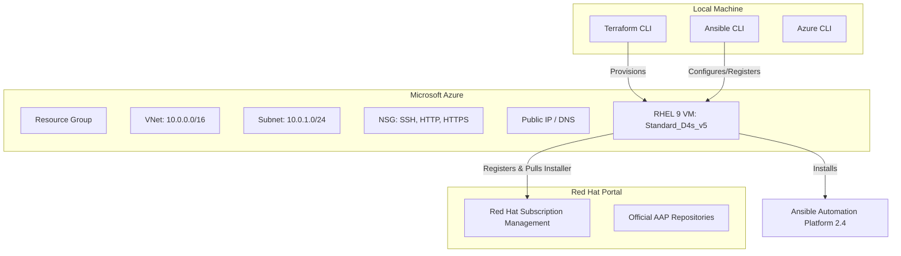

# Ansible Automation Platform (AAP) on Azure — Lab

[]()
[]()
[]()
[]()
[]()
[]()

A lightweight, self-managed lab to deploy Red Hat Ansible Automation Platform (AAP) 2.x on a single RHEL VM in Microsoft Azure. This repository uses Terraform to provision the VM and Ansible to register RHEL and bootstrap the official AAP installer.

Why this repo exists
- Avoids the heavy Azure Marketplace Managed Application (AKS + high vCPU requirements).
- Provides a low-cost single-controller lab for learning AAP and experimenting with Azure integrations.

## Table of Contents
- Quickstart
- Architecture
- Prerequisites
- Cost Estimation
- Terraform: Provision the VM
- Ansible: Register RHEL & Bootstrap Installer
- Run the AAP Installer
- Access & Configure AAP
- Automate Azure from AAP
- Security Best Practices
- Monitoring and Logging
- Backup and Restore
- Upgrade and Migration
- Repository Improvements
- Troubleshooting
- Cleanup
- Contributing
- License
- Contact

## Quickstart (3-minute)
1. Set up credentials using Ansible Vault (see `playbooks/SECURITY_SETUP.md`).
2. Copy `terraform/terraform.tfvars.example` to `terraform/terraform.tfvars` (git-ignored) and set a unique `public_ip_dns_label`, `ssh_public_key_path`, plus `allowed_ssh_source_ip` and `allowed_web_source_ip`. Both are required and must be specific CIDRs, e.g. `203.0.113.1/32`; `*` and `0.0.0.0/0` are rejected.
3. cd terraform && terraform init && terraform apply -auto-approve
4. Use `terraform` output to SSH to the VM, then cd to `/opt/aap-installer` and follow the installer steps in this README.

## GitHub Actions Deployment

For automated deployment using GitHub Actions:
1. Push changes to main branch to trigger workflow
2. Download `ssh-private-key` artifact from workflow run
3. Download `install-aap-script` artifact from workflow run
4. Connect to VM: `ssh -i downloaded_key azureuser@<public_ip>`
5. Install AAP: `bash install-aap.sh`

## Architecture Diagram



## Cost Estimation

Running this lab will incur Azure costs. Estimated monthly costs for the default configuration:

| Resource | SKU | Est. Monthly Cost* |
|----------|-----|-------------------|
| VM (Standard_D4s_v5) | 4 vCPUs, 16GB RAM | $100-150 |
| OS Disk (64GB Premium SSD) | P10 | $15-20 |
| Data Transfer | ~100GB | $8-12 |
| Public IP | Standard SKU | $3-5 |
| Total | | **$126-187** |

*Prices are estimates based on East US region as of 2026-08. Actual costs vary by region and usage.

**Cost Optimization Tips:**
- Stop/deallocate VM when not in use to save compute costs
- Use smaller VM size (Standard_D2s_v5) for testing ($50-75/month)
- Enable Azure Cost Management and billing alerts
- Consider reserved instances for long-term deployments

## Prerequisites

Before starting, ensure you have the following ready:
1. **Microsoft Azure Account:** A valid subscription where you can provision VMs (requires at least 4 vCPUs and 16 GB RAM).
2. **Azure CLI:** Installed locally and logged in (`az login`).
3. **Terraform:** Installed locally (v1.0+).
4. **Ansible:** Installed locally (used to run the bootstrap playbook).
5. **SSH Keypair:** A local public key (typically `~/.ssh/id_rsa.pub`) to authenticate to the VM.
6. **Red Hat Developer Account:**
   - Register for free at https://developers.redhat.com/.
   - Once registered, your account receives the **Red Hat Developer Subscription for Individuals**, which includes RHEL licenses and 16 entitlements for the Ansible Automation Platform.

### Security note
- Do NOT commit secrets (passwords, client secrets, private keys) into this repository.
- Change any default passwords in `/opt/aap-installer/inventory` before production use.
- Use Ansible Vault for credential management (see `playbooks/SECURITY_SETUP.md`).
- Restrict access by setting `allowed_ssh_source_ip` and `allowed_web_source_ip` in `terraform.tfvars` to your public IP; internet-wide values are rejected.
- Never commit `terraform.tfstate*` or `terraform.tfvars`: state files record public IPs, keys and other resource details in cleartext.

## Step 1: Provision infrastructure with Terraform

1. Change to the terraform directory:
   ```bash
   cd terraform
   ```

2. Copy and edit variables:
   ```bash
   cp terraform.tfvars.example terraform.tfvars
   # Edit terraform.tfvars:
   # - public_ip_dns_label = "aap-controller-lab-unique"
   # - ssh_public_key_path = "~/.ssh/id_rsa.pub"
   ```
   Example snippet:
   ```hcl
   public_ip_dns_label = "aap-controller-lab-unique"
   location            = "eastus"
   ssh_public_key_path = "~/.ssh/id_rsa.pub"
   ```

3. Initialize, plan, and apply:
   ```bash
   terraform init
   terraform plan
   terraform apply -auto-approve
   ```

4. Note outputs:
   - `public_ip_address` — VM IP
   - `public_ip_dns_name` — DNS name to access AAP
   - `ssh_command` — suggested SSH command

## Step 2: Register RHEL & Bootstrap AAP installer (Ansible)

From your local machine run the bootstrap playbook. Replace `<YOUR_VM_PUBLIC_IP>` with the public IP or DNS from Terraform outputs:

```bash
cd ansible
ansible-playbook -i "<YOUR_VM_PUBLIC_IP>," -u azureuser bootstrap_rhel.yml
```

Important: the trailing comma in the inventory string tells Ansible this is a one-host ad-hoc list.

What the playbook does:
- Registers your VM to Red Hat
- Enables AAP repositories
- Installs `ansible-automation-platform-installer`
- Prepares `/opt/aap-installer/`

## Step 3: Complete the AAP installation on the VM

1. SSH to the VM (use the `ssh_command` output from terraform):
   ```bash
   ssh -i ~/.ssh/id_rsa azureuser@<YOUR_VM_DNS_NAME>
   ```

2. Edit the installer inventory (change these default passwords!):
   ```bash
   sudo vi /opt/aap-installer/inventory
   # Update admin_password and database passwords before running the installer
   ```

3. Run the official setup:
   ```bash
   cd /usr/share/ansible-automation-platform-installer
   sudo ./setup.sh -i /opt/aap-installer/inventory
   ```

Expected runtime: ~10–20 minutes. Success message:

```
The setup process completed successfully.
```

## Step 4: Access & configure AAP

- Browse to: https://<YOUR_VM_DNS_NAME>
  - Bypass the browser certificate warning (self-signed cert).
- Login:
  - Username: `admin`
  - Password: value of `admin_password` in `/opt/aap-installer/inventory`
- Activate subscription by entering your Red Hat Customer Portal credentials.

## Step 5: Automate Azure from AAP

1. Create Azure credentials in AAP (Resources > Credentials > Add > Microsoft Azure Resource Manager).
   - Fill Subscription ID, Client ID, Client Secret, Tenant ID.

2. Create an Azure dynamic inventory source using the Azure RM inventory plugin. In the Source Variables box paste:

```yaml
plugin: azure.azcollection.azure_rm
auth_source: auto
keyed_groups:
  - key: location
    prefix: location
  - key: tags
    prefix: tag
```

3. Add the repo's `playbooks/azure_vm_provision.yml` as an AAP Project, create a Job Template, and launch it.

## Troubleshooting (common issues)

- SSH fails: verify NSG allows port 22 and your local IP is allowed; check `ssh_public_key_path` used in Terraform.
- Red Hat registration errors: ensure your developer account has been fully activated and has entitlements remaining.
- Installer hangs or services fail: check `/var/log/` and `journalctl` for details; installer logs appear in `/tmp/ansible-local-...` during run.
- DNS not resolving: use the `public_ip_address` directly if `public_ip_dns_name` takes time to propagate.
- Credential errors: Ensure you've set up Ansible Vault or environment variables as described in `playbooks/SECURITY_SETUP.md`.

For comprehensive troubleshooting, see [TROUBLESHOOTING.md](TROUBLESHOOTING.md) which covers:
- Infrastructure issues
- Installation problems
- Configuration issues
- Runtime and performance issues
- Security and network issues
- Backup/restore and upgrade issues

## Security Best Practices

This repository includes comprehensive security improvements including credential management, network security, and input validation.

**Key Security Features:**
- Ansible Vault for credential management
- Restricted SSH access by IP
- Input validation for all configurations
- Comprehensive security documentation

See [playbooks/SECURITY_SETUP.md](playbooks/SECURITY_SETUP.md) for detailed security setup instructions.

## Repository Improvements

This repository has been significantly enhanced with production-ready features:

**🔒 Security Improvements:**
- Removed hardcoded credentials and implemented Ansible Vault
- Added network security with IP-restricted SSH access
- Input validation for all Terraform variables
- Comprehensive security documentation

**💰 Cost Management:**
- Detailed cost estimation with optimization tips
- Azure resource cost tracking

**📊 Monitoring & Observability:**
- Enhanced logging with configurable retention
- Prometheus metrics exporter
- Automated health checks
- Azure Monitor integration
- Grafana dashboard support

**💾 Backup & Recovery:**
- Automated backup procedures
- Database and configuration backups
- Point-in-time recovery
- Azure Storage integration

**🚀 Deployment Automation:**
- Automated AAP installation
- CI/CD pipeline with GitHub Actions
- Automated validation and testing

**🔧 Operations:**
- Comprehensive upgrade procedures
- Automated validation and testing
- Extensive troubleshooting guide

**📖 Documentation:**
- Enhanced README with all features
- Security setup guide
- Monitoring configuration guide
- Backup and restore procedures
- Upgrade and migration guide
- Comprehensive troubleshooting guide

## Monitoring and Logging

Comprehensive monitoring and logging capabilities are included to ensure visibility into system health and performance.

**Features:**
- Enhanced logging with configurable retention
- Prometheus-compatible metrics exporter
- Automated health checks
- Optional Azure Monitor integration
- Grafana dashboard support

See [MONITORING.md](MONITORING.md) for complete monitoring setup and configuration.

## Backup and Restore

Automated backup and restore procedures protect your AAP deployment and data.

**Features:**
- Automated daily backups
- Database and configuration backups
- Configurable retention policies
- Azure Storage integration
- Point-in-time recovery

See [BACKUP_RESTORE.md](BACKUP_RESTORE.md) for backup procedures and disaster recovery.

## Upgrade and Migration

Procedures for upgrading AAP are provided to ensure smooth transitions.

**Features:**
- Automated upgrade playbooks
- Pre-upgrade validation and backup
- Rollback capabilities
- Version-specific upgrade notes

See [UPGRADE_MIGRATION.md](UPGRADE_MIGRATION.md) for upgrade procedures and best practices.

## Cleanup

Destroy all Azure resources when done:

```bash
cd terraform
terraform destroy -auto-approve
```

Note: this deletes the resource group, public IP, VM, and related resources.

## Security Best Practices

This repository includes several security improvements:

1. **Credential Management**: Use Ansible Vault or environment variables instead of hardcoded credentials (see `playbooks/SECURITY_SETUP.md`)
2. **Network Security**: Restrict SSH access by setting `allowed_ssh_source_ip` in Terraform variables
3. **Input Validation**: Terraform variables include validation to prevent misconfiguration
4. **Health Checks**: Automated health checks verify AAP installation status
5. **Git Security**: Updated `.gitignore` prevents committing sensitive files

Always review security settings before deploying to production environments.

## Contributing

PRs welcome. Please open issues for bug reports or feature requests.
Keep terraform/ansible changes isolated to their directories and avoid adding sensitive data.
Security-related changes should be prioritized and thoroughly tested.

## License

Add your license here (MIT, Apache-2.0, etc.). Replace the badge at the top accordingly.

## Contact

Maintainer: https://github.com/Deepan99

---

Changelog / Tested
- Tested with: Terraform v1.x, RHEL 9, AAP 2.4 on Azure eastus (update with exact versions you test with).
